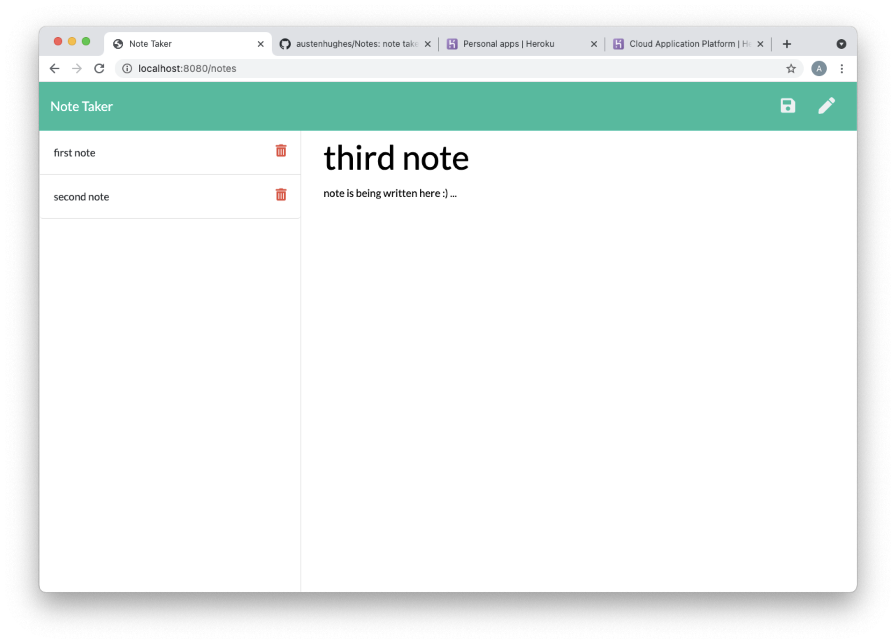

# Notes

Here you will find an application built to create, store, recall and delete notes ass needed.

## Installations :

to run on your localhost you will need :
- npm uuidv4 : https://www.npmjs.com/package/uuid4
- npm express : https://www.npmjs.com/package/express

## Directions :

- you will open the program with the following link : https://vast-cliffs-58167.herokuapp.com/
- this link will take you to opening page
- you can then click the button to access the note taker
- the note taker will present you 
     - a column on the left with the titles of saved notes stacked in a list 
     - on the right you will find a place to enter a note and a title for that note
- when a fresh note has been entered in the field and given a title you will be presented a save option in the upper right hand corner
- when you click this button your notes title will be added the the list of titles on the left
- when you click on any of those note titles the note will be brought back up and presented in the right had column ... it will be set to read only
- if you would like to write another note just click on the pen icon which can be found in the upper right hand corner
- each other the note titles stored in the left column has a delete icon in line ot the right ... if clicked that note will disappear

## Visual aid :

## Github :

github repo : https://github.com/austenhughes/Notes

## Heroku :

Heroku link : https://vast-cliffs-58167.herokuapp.com/

## Recourses :

w3schools : https://www.w3schools.com/  
mozilla : https://developer.mozilla.org/en-US/  
stackoverflow : https://stackoverflow.com/  
express &
express docs : https://www.npmjs.com/package/express  
uuidv4 &
uuidv4 docs : https://www.npmjs.com/package/uuid4  
Heroku : https://www.heroku.com/  

## contact me at :
Email : austen.hughes.91@gmail.com
github : https://github.com/austenhughes
